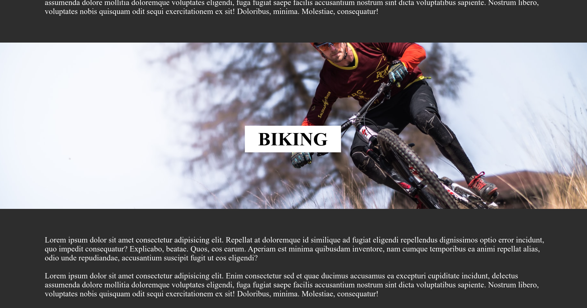

# Parallex Project

## Description
Parallex Project is a simple static website. In this project some CSS properties are
used to create a parallex effect while scrolling. This type of effect is seen in some of
the famous websites, APPLE being one of the most relevant one.

I made this project while learning CSS.

## Languages Used
- HTML
- CSS

## Demo 1

## Demo 2
